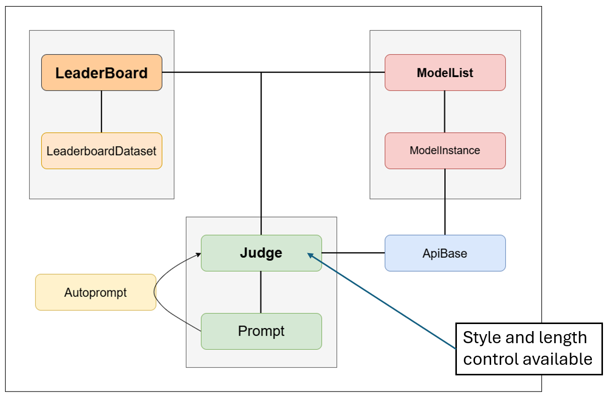

# LLM-as-a-Judge (benchmark)

Python toolkit for **pairwise LLM judging** on arena-style datasets: OpenAI-compatible judge APIs, optional **position-swapped** double passes, **FastChat-style style / length control** (contextual Bradley–Terry), **leaderboard orchestration** (generation, battles, artifact dumps), **CoolPrompt autoprompt** tuning, and ** sklearn metrics** against human labels.

---

## Features

| Area | What you get |
|------|----------------|
| **Judge** | `LLMAsJudge` — batched requests, retries/logging, `Prompt` with `{field}` patterns and optional `dataset_mapping` |
| **Data** | `LeaderboardDataset` — load **JSON** (list or single-key dict) or **JSONL**; optional Hugging Face `datasets` |
| **Arena loop** | `Leaderboard` + `ModelList` / `ModelInstance` — align rows by `id`, `make_battle`, run judge, persist under `artifacts/<slug>/` |
| **Style / length** | `train_style_control` / `apply_style_control` and length-only twins — markdown-derived features + contextual BT (`benchmark/style_control.py`) |
| **Evaluation** | `evaluate_judge`, `prepare_eval_arrays` — accuracy, F1, Cohen’s κ, MCC, confusion matrix (`benchmark/evaluating_tools.py`) |
| **Autoprompt** | `Leaderboard.tune_judge_autoprompt` — CoolPrompt + LangChain (optional deps) |

---

## Architecture

Overview of how `Leaderboard`, `ModelList` / `ModelInstance`, `LLMAsJudge` / `Prompt`, `ApiBase`, autoprompt, and style/length control fit together:



---

## Repository layout

```text
llm-as-a-judge/
├── benchmark/
│   ├── judge.py              # LLMAsJudge, Prompt, ApiBase
│   ├── leaderboard.py      # LeaderboardDataset, Leaderboard
│   ├── model_instance.py     # ModelInstance, ModelList
│   ├── style_control.py      # BT + style/length features
│   ├── tools.py              # make_battle, batching, logging
│   ├── evaluating_tools.py   # metrics vs human
│   └── autoprompt.py         # CoolPrompt tuning helpers
├── artifacts/
│   └── prompts.json          # named prompt templates (optional library)
└── datasets/                 # example JSON / answers (optional)
```

Run code with the **project root** (`llm-as-a-judge/`) as the current working directory so imports like `from benchmark.judge import LLMAsJudge` resolve. Alternatively set `PYTHONPATH` to that directory.

---

**Typical sequence**

1. Load rows into `LeaderboardDataset` (each row should have a stable **`id`**; pairwise rows need **`instruction`**, **`model`**, **`reference`**, **`model_answer`**, **`reference_answer`** for prompts that use those placeholders).
2. Configure **`LLMAsJudge`** (API host, key, judge model id, path) and **`set_prompt`** / **`set_config`**.
3. Either attach precomputed answers on **`ModelInstance`**, or call **`Leaderboard.generate_all_model_answers`** for models that expose an API.
4. **`Leaderboard.run_judge_with_baselines`** merges by `id`, runs **`evaluate_dataset`** (optionally with **`swapping_pos=True`** for order debiasing), and can persist JSON under **`artifacts/<dataset_slug>/judge/`**.
5. Compare judge verdicts to human winners with **`prepare_eval_arrays`** + **`evaluate_judge`**.
6. Optionally fit **style** or **length** control on a **train** split, then **`apply_*`** on test battles together with the judge label.

---

## Installation

Core runtime (adjust versions for your environment):

```bash
cd llm-as-a-judge
pip install numpy pandas scipy scikit-learn requests tqdm
```

Optional:

- **`datasets`** — `LeaderboardDataset.from_huggingface(...)`
- **`langchain-openai`**, **`coolprompt`** — autoprompt tuning (`tune_judge_autoprompt`)

Store secrets in **`.env`** (already gitignored) or your shell; the judge expects a **Bearer** token and an OpenAI-style **`messages`** payload (see `benchmark/judge.py`).

---

## Minimal example (direct judge)

```python
from benchmark.judge import LLMAsJudge

judge = LLMAsJudge(
    api_base_host="https://your-host/v1",
    openai_api_key="sk-...",
    judge_model="your-judge-model",
    judge_path="chat/completions",  # appended to host; adjust to your server
    num_procs=8,
)
judge.set_config()
judge.set_prompt(
    from_file="artifacts/prompts.json",
    prompt_name="best_prompt3",
    mapping=None,  # or {"instruction": "prompt", ...} if keys differ
)

# Each dict: keys required by the prompt pattern, e.g. instruction, model_answer, reference_answer, model, reference, id
battle_rows = [...]
results = judge.evaluate_dataset(battle_rows, swapping_pos=True)
```

Prompt patterns use Python **`str.format`** placeholders. Save or load named prompts via **`Prompt.save_prompt` / `load_prompt`** and the JSON library under **`artifacts/prompts.json`**.

---

## Style / length control (sketch)

```python
# After judge outputs exist, train on human (or silver) winners parallel to train_dataset:
state = judge.train_style_control(train_dataset, winners, reg=10.0)
p_a_wins = judge.apply_style_control(sample_dict, judge_label="model", judge_strength=1.0)
```

`winners` entries can be encoded as `1` / `0`, `"model"` / `"reference"`, etc. (see docstrings in `judge.py`).

---

## Prompt library

`artifacts/prompts.json` ships with several named templates (pairwise tuples, rubric JSON, advantages/disadvantages pipeline, autoprompt “best_prompt*”, etc.). Point **`from_file`** at this path or maintain your own library.
